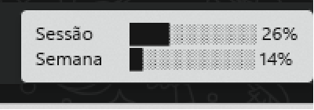

# spec-windows

Monitor de permissões e uso do Claude Code no Windows: quando o Claude Code
for pedir permissão para rodar um comando ou editar um arquivo, em vez do
prompt normal do terminal, um ícone na bandeja do sistema (e uma toast
notification) deixa você aprovar ou negar com um clique — sem sair do que
estava fazendo. O mesmo ícone também mostra, no menu de clique-direito e no
tooltip, quanto da sua cota de uso (5h / 7 dias) já foi consumida.


Porta do [spec-fedora](https://github.com/EduardoRFortes/spec-fedora) (Fedora/
GNOME) para Windows. Mesmo protocolo, mesmo mecanismo (hooks oficiais do
Claude Code, sem scraping de terminal) — só a "cara" muda: AppIndicator3 +
libnotify → bandeja nativa do Windows (`Shell_NotifyIcon`) + toast.

Ver [PROTOCOL.md](./PROTOCOL.md) para o protocolo do pipe e os timeouts.

## Como funciona

```
Claude Code ── hook PreToolUse ──▶ spec-hook (Rust) ── named pipe ──▶ specd (Rust)
     ◀── allow / deny ◀──────────────────────────────────────────────◀── clique na bandeja
```

**Regra de ouro: fail-open.** Igual ao spec-fedora — se o daemon não
estiver rodando, travar, ou demorar demais, o hook sai silenciosamente e o
prompt normal do terminal aparece.

## Diferenças em relação ao spec-fedora

- **Transporte:** named pipe (`\\.\pipe\spec`) em vez de unix socket, via
  crate [`interprocess`](https://docs.rs/interprocess) — mesma API de
  stream dos dois lados, então o `hook/` fica quase idêntico ao original.
- **Daemon:** Rust (`tray-icon` + notificações nativas) em vez de
  Python/GTK3 — não faz sentido puxar GTK pro Windows, e dá pra escrever um
  daemon único binário sem runtime.
- **Sem systemd:** `specd` inicia via Tarefa Agendada do Windows
  (trigger "at logon", com reinício automático se cair) em vez de um
  serviço `systemd --user`.

## Status

Funcionando de ponta a ponta com o Claude Code real: hook de permissão,
notificação toast, barras de uso na própria bandeja e início automático no
boot.

## Instalação

### Pré-requisitos

- Windows 10 ou 11.
- [Claude Code](https://claude.com/product/claude-code) já instalado e
  logado (é ele quem dispara os hooks que o Spec escuta).
- Toolchain Rust ([rustup.rs](https://rustup.rs)) com o target MSVC — o
  instalador do `rustup` já resolve isso, incluindo pedir as *Build Tools
  for Visual Studio* se não estiverem presentes.
- `git`.

> **Atenção, máquinas corporativas:** as *Build Tools for Visual Studio*
> (workload "Desktop development with C++", que traz o linker `link.exe`
> usado pelo target MSVC) costumam pedir **privilégio de administrador**
> para instalar, mesmo quando o resto do processo (`rustup`, `cargo build`,
> o `install.ps1`) não pede. Se elas já estiverem instaladas na máquina,
> nada disso é necessário — mas em uma instalação limpa, sem conta admin
> local, o `rustup-init` vai travar nesse passo. Peça pro time de TI
> instalar as Build Tools (ou o Visual Studio completo) antes de tentar
> compilar.

### Passo a passo

1. Clone o repositório e entre na pasta:
   ```powershell
   git clone https://github.com/EduardoRFortes/spec-windows.git
   cd spec-windows
   ```
2. Rode o instalador (PowerShell comum, não precisa ser admin):
   ```powershell
   .\install\install.ps1
   ```
   Se o PowerShell bloquear o script por política de execução, rode com
   `powershell -ExecutionPolicy Bypass -File install\install.ps1` em vez
   disso.

O que o `install.ps1` faz, em ordem:

1. Compila os três binários em release (`cargo build --release`).
2. Registra o hook `PreToolUse` e a `statusLine` em
   `~/.claude/settings.json` (faz backup do arquivo antes de mexer).
3. Cria (ou atualiza) a Tarefa Agendada `SpecWindowsTray`, que sobe o
   `specd` a cada logon e reinicia sozinha até 3x se o processo cair.
4. Se o `specd` não estiver rodando ainda, inicia ele na hora — não
   precisa reiniciar o Windows pra ver o ícone aparecer.

É idempotente: pode rodar de novo a qualquer momento (por exemplo depois de
um `git pull` com binários novos) que ele só atualiza o que mudou.

### Verificando que funcionou

O ícone laranja do mascote deve aparecer na bandeja do sistema (se estiver
escondido nos ícones ocultos, o Spec tenta se promover para a área visível
sozinho nos primeiros segundos). Passe o mouse por cima pra ver o uso da
sua cota (o mesmo aparece no menu de clique-direito):



Pra testar o fluxo de permissão de verdade, peça pro Claude Code rodar
qualquer comando que normalmente pediria confirmação (ex.: `rm` em algum
arquivo de teste) — deve chegar uma notificação e um item Permitir/Negar
no menu da bandeja em vez do prompt de terminal.

### Sessões remotas (SSH / VS Code Remote)

Por padrão o Spec só enxerga o Claude Code rodando localmente no Windows —
`spec-statusline.exe` fala com o `specd` local por named pipe. Se você roda
o Claude Code dentro de uma VM ou container acessado por SSH (incluindo
VS Code Remote - SSH), esse processo é Linux e nunca chama um binário
Windows, então a bandeja fica presa nos últimos dados da sessão local.

Para cobrir esse caso, o `specd` também escuta `POST /usage` em
`127.0.0.1:27182` (ver [PROTOCOL.md](./PROTOCOL.md)). Configuração:

1. Copie o hook Python (sem dependências, só precisa de `python3` na VM)
   pra VM:
   ```powershell
   scp hook\spec-statusline-remote.py usuario@vm:~/
   ```
2. Na VM, registre-o como `statusLine` no `~/.claude/settings.json`:
   ```bash
   chmod +x ~/spec-statusline-remote.py
   python3 - << 'EOF'
   import json, os
   path = os.path.expanduser("~/.claude/settings.json")
   cfg = json.load(open(path)) if os.path.exists(path) else {}
   cfg["statusLine"] = {
       "type": "command",
       "command": f"python3 {os.path.expanduser('~/spec-statusline-remote.py')}",
   }
   json.dump(cfg, open(path, "w"), indent=2)
   EOF
   ```
3. No Windows, adicione ao `~/.ssh/config` um `RemoteForward` pra sessão
   sempre levar a porta de volta pro `specd` local:
   ```
   Host vm-ou-alias
       RemoteForward 27182 localhost:27182
   ```
   (ou, pra ativar só quando precisar, sem mexer no config:
   `ssh -R 27182:localhost:27182 usuario@vm`.)

Com o túnel ativo, qualquer sessão de Claude Code dentro dessa VM atualiza a
mesma bandeja do Windows. Sem o túnel (ou com o `specd` fechado), o hook
remoto falha em silêncio — mesma regra de fail-open do resto do projeto, só
que aqui não há decisão nenhuma pra travar, então "falhar" só significa que
a bandeja não atualiza.

### Desinstalar

```powershell
Unregister-ScheduledTask -TaskName "SpecWindowsTray" -Confirm:$false
Stop-Process -Name specd -Force
```

E remova manualmente as entradas `hooks.PreToolUse` / `statusLine` que
apontam para `spec-hook.exe` / `spec-statusline.exe` do seu
`~/.claude/settings.json` (o `install.ps1` guarda um backup do arquivo do
jeito que estava antes, em `settings.json.bak.<timestamp>`, se quiser
comparar).

## Componentes

- `hook/` — `spec-hook` (Rust), registrado como hook `PreToolUse`; e
  `spec-statusline`, registrado como `statusLine`. Também
  `spec-statusline-remote.py`, o equivalente do `spec-statusline` pra
  sessões de Claude Code rodando em VMs/containers via SSH (ver
  [Sessões remotas](#sessões-remotas-ssh--vs-code-remote) acima).
- `daemon/` — `specd` (Rust), bandeja + notificações + estado dos pedidos
  pendentes + Tarefa Agendada para autostart.
- `install/` — `install.ps1` (fluxo completo) e `merge_settings.ps1`
  (registro do hook/statusLine em `~/.claude/settings.json`).
